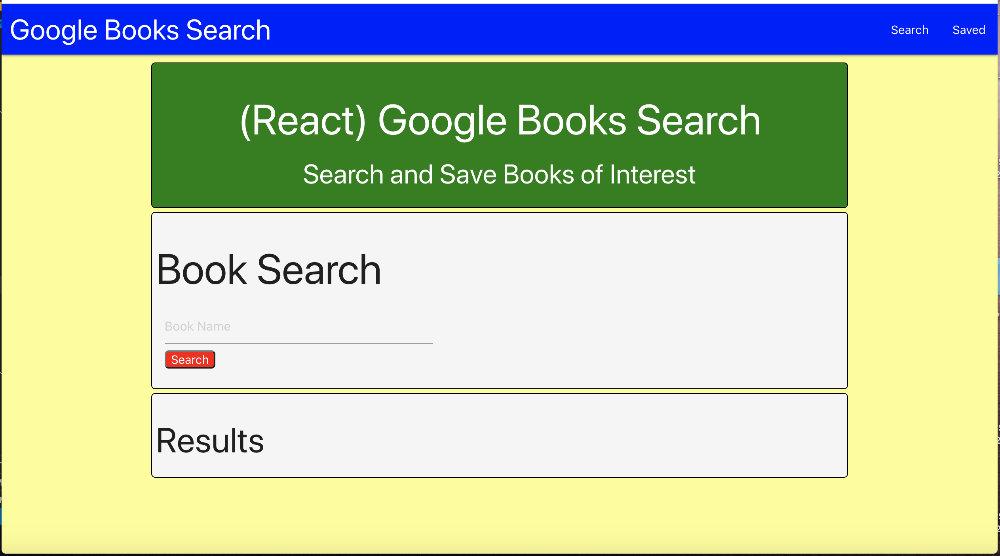
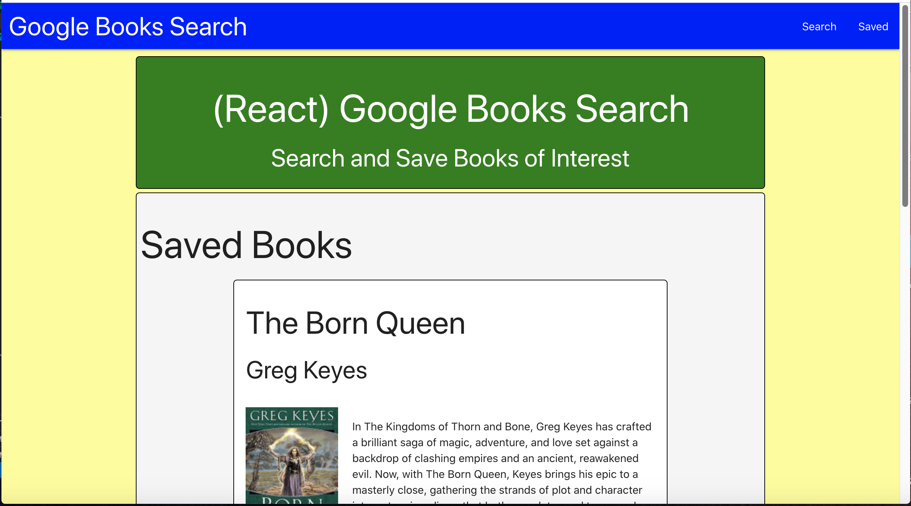

# Google Books Search

## Description
This app allows the user to search the Google Books API, view PDFs of the books, and save them.

## Table of Contents
* [Installation](#installation)

* [Usage](#usage)

* [Contributing](#contributing)

* [Questions](#questions)

## Installation
1. Download the repository from GitHub
2. run "npm install" to install dependencies
3. run "npm start" to run the server
3. go to localhost:3000 to use the app

Note: The Google API key is not included, so you will need to get one and set it as an environmental variable to run it locally.

## Usage
[Deployed App](https://tranquil-eyrie-73993.herokuapp.com/saved)

Enter the search criteria in the search bar, then click search. When the results appear, you can click "View" to see a PDF of the book, or "Save" to save it to your list. When you go to the Saved page, you can again click "View" to see the book, or "Delete" to remove the book.

## Contributing
Please do not contribute to this project.

## Questions
If you have any questions, you can email me directly at roblingjohn@gmail.com. 
Please visit my GitHub page at [roblingjohn](http://github.com/roblingjohn).
        
